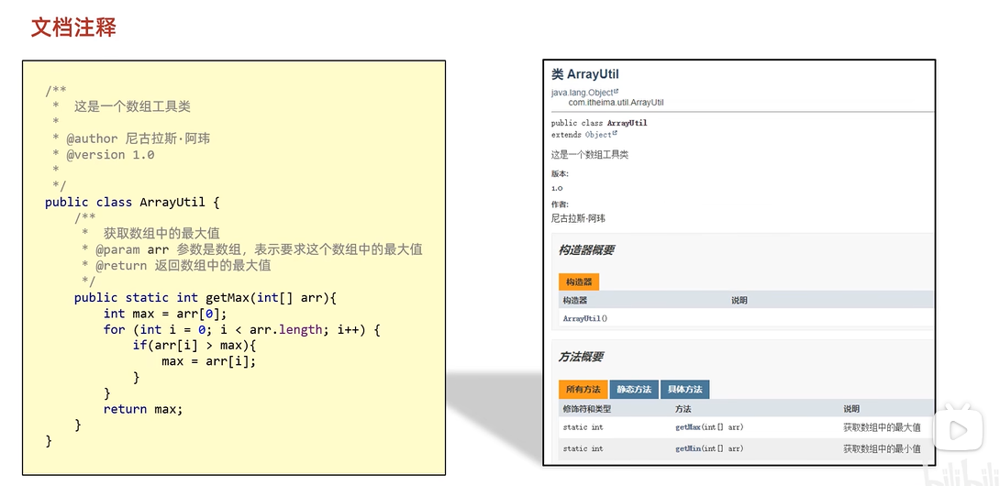
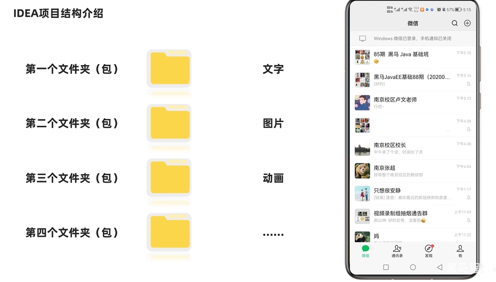

## 1、文档注释

1、JAVADUC工具生成文档注释
[text](readme.md) 

``` java
import java.until.Scanner

pulic class scanner {
  public static void main(String[] args){
    //创建对象，表示当前要使用这个Scanner这个类
    Scanner sc = new Scanner();
    //接收数据
    //变量n记录了Scanner输入的内容
    int n = sc.nextInt();

    System.out.println(n);
  }
}
```

## 2、IDEA项目结构
* project项目
  * module  模块
    * package 包
      * class 类
      * 包的分类：


