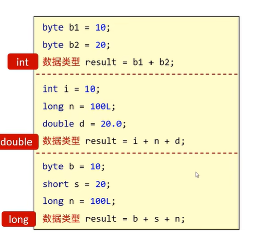
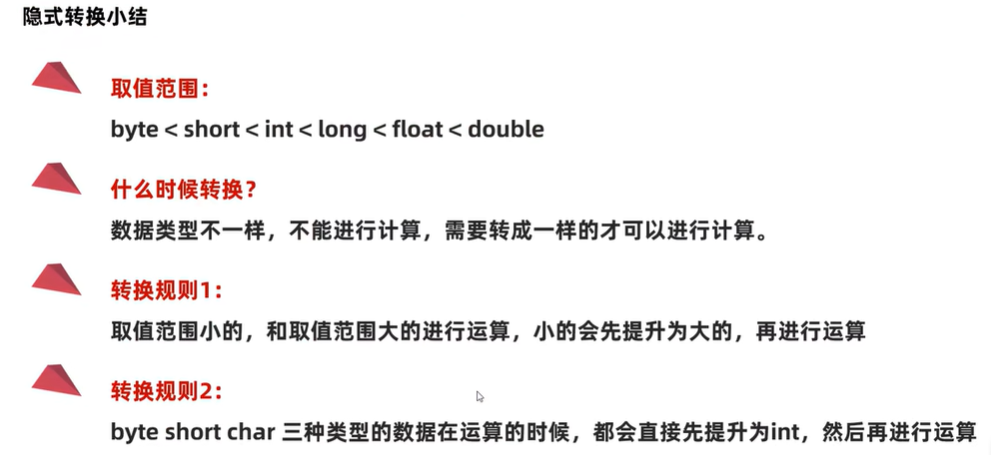
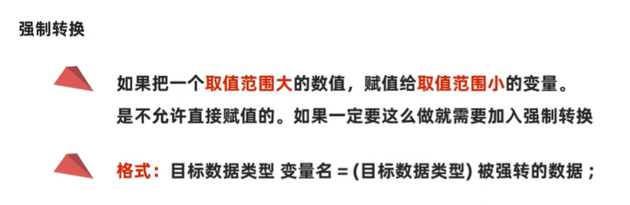
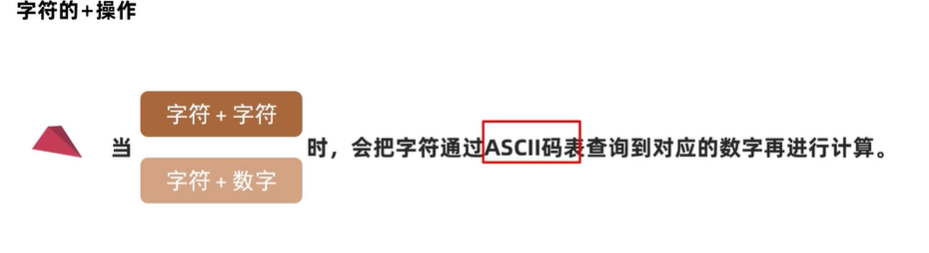
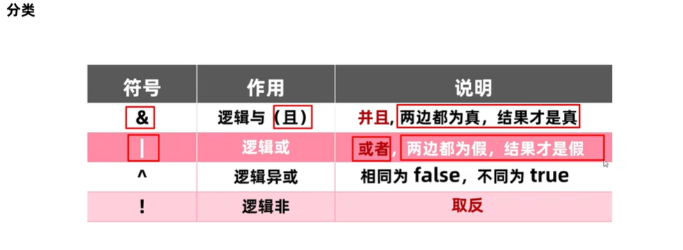
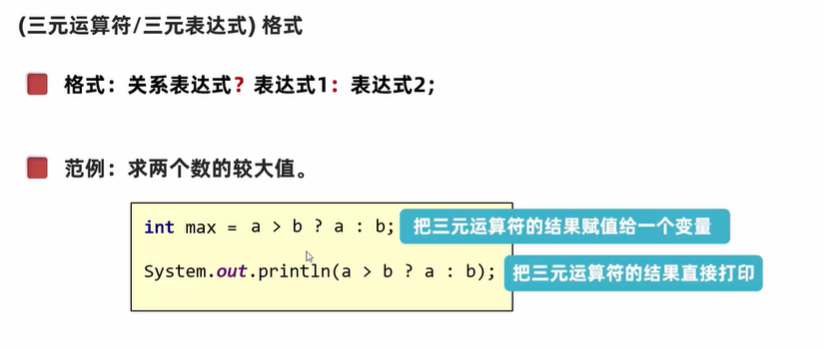

## 1、运算符
* 算术
  * 
  * 
  * 
  * 强转
    ```java
    byte a = 10;
    byte b = 20;
    byte result = (byte)(a + b);

    System.ouyt.println(result);
    ```
  * 字符串相加
   ```java
    public class text {
      public static void main(String[] args){
        char c = 'a';
        int result = c + 0;

        System.out.println(result);//97 -- c --> a --> 为根据ASCNII码将a转为int类型
      }
    }
   ```
   * 
* 自增自减
  * ++/--放在前后单写时，功能一样
  * 参与计算，不一样：
    * 
    ```java
    int a = 10
    int b = a++ // 10 先用后加

    int c = 10
    int d = ++c // 11 先加后用
    ```

  * 自增自减场景应用

* 赋值
* 关系
* 逻辑
  * 
* 运算符优先级
  * & 逻辑且
  * | 逻辑或
  * ^ 逻辑异或
  * ! 逻辑取非
  * 短路运算符
    * && 结果与&相同，但是短路效果
    * ||  结果和|相同，但是也有短路效果
      ```java
      //简单理解：当左侧的表达式能确定最终结果，那么右侧不参与判断
      int a = 10;
      int b = 10;
      boolen result = ++a < 5 && ++ b < 5;

      System.out.println(result); //false
      System.out.println(a);  //11
      System.out.println(b) //10


      ```
      ```java
      package com.test3;

      import java.util.Scanner;

      public class test3 {
        public static void main(String[] args) {
          /**
           * 输入俩整数，如果其中一个为6，则true;否则为false
           */
          Scanner sc = new Scanner(System.in);
          System.out.println("请输入俩整数");
          System.out.println("请输入第一个整数");
          int a = sc.nextInt();
          System.out.println("请输入第二个整数");
          int b = sc.nextInt();

          if(a == 6 || b == 6) {
            System.out.println("true");
          } else {
            System.out.println("false");
          }

          boolean result = a == 6||b == 6 || (a + b) % 6 == 0;

          System.out.println(result);

          
        }
      }
      ```

* 三元运算符
  * 
  ```java
   public class test3{
    public static void main(String[] args) {
      int a = 10;
      int b = 12;
      int max = a > b ? a:b;  //判断a、b的大小；如果a>b，则为true，赋给max=a；否则为false，赋给max = b；
      System.out.println(max) ; // 20
      System.out.println( a > b ? a : b); // 20
    }
   }
  ```

  ```java
  /**
   * 判断体重
   三目表达式
   */

   package com.test4;

   import java.util.Scanner;

   public class test4 {
    public static void main(String[] args) {
      Scanner sc = new Scanner(System.in);
      System.out.println("请输入第一个整数");
      int num1 = sc.nextInt();
      System.out.println("请输入第一个整数");
      int num2 = sc.nextInt();

      boolean result = a > b ? a : b;
      System.out.println("result");

      int max = a > b ? a : b;
      System.out.println("体重大的为" + max);

      String result = a == b ? "相同" : "不同";
      System.out.println(result);
    }
   }
  ```
  ```java
  /**
   * 三个人，体重分别为120/130/150，求最大体重
   */
  package com.test5;

  public class weight {
    public static void main(String[] args) {
      int num1 = 120;
      int num2 = 130;
      int num3 = 150;

      int temp = num1 > num2 ? num1 : num2;
      int max = temp > num3 ? temp : num3;

      System.out.println("max");


    }
  }
  ```

---
