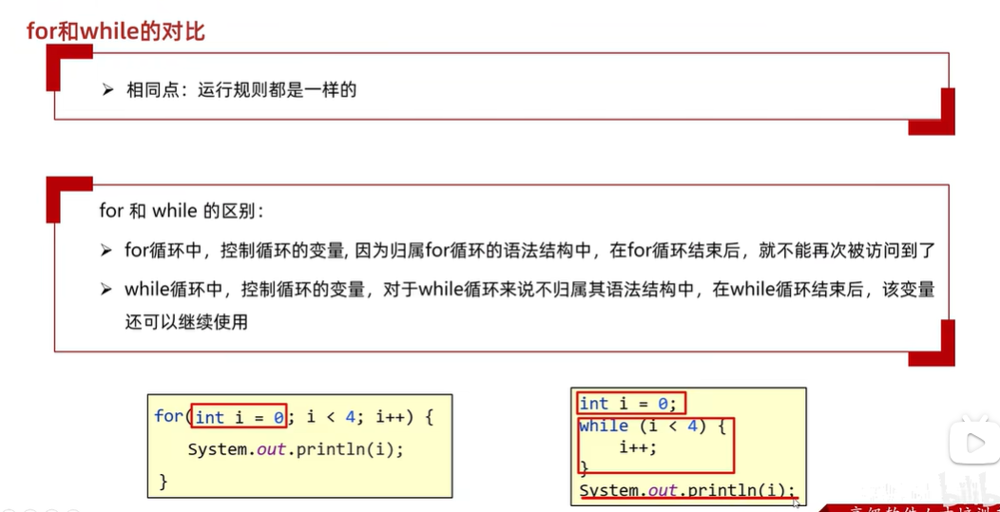
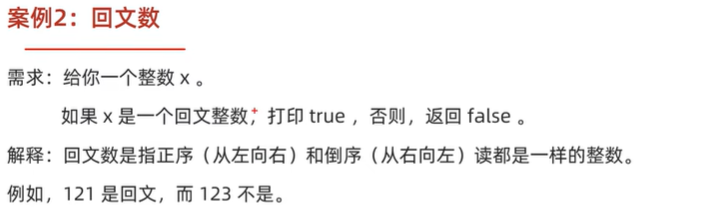
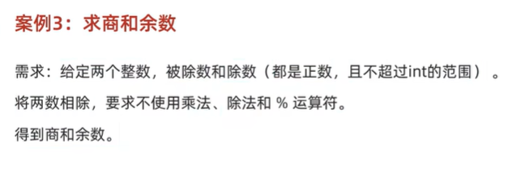

## Day04  流程控制
---
## 1、判断
1、if
```java
  if () {

  }

  if () {

  } else if() {

  } else {

  }
```
2、switch
```java
  switch () {
    case A:
      System.out.println("");
      break;
    case B:
      System.out.println("");
      break;
     case C:
      System.out.println("");
      break;
    default:
      System.out.println("");
      break; 
  }
```
```java
  package com.test6;

  import java.util.Scanner;

  public class noddles {
    public static void main(String[] args) {
      Scanner sc = new Scanner(System.in);

      String day = sc.nextLine();

      switch (day) {
        case "Monday":
          System.out.println("A");
          break;
        case "Tuesday":
          System.out.println("B");
          break;
         case "Wednesday":
          System.out.println("C");
          break;
         case "Thursday":
          System.out.println("D");
          break;
         case "Friday":
          System.out.println("E");
          break;
         default:
          System.out.println("Std");
          break;      
      }
      sc.close();

      /**
       * 写法2
       */

      int number = 1;
      switch (number) {
        case 1 -> {
          System.out.println("一");
          }
         case 2 -> {
          System.out.println("二");
         }
         default -> {System.out.println("无");} 
      }

      /** 
       * 写法三
       */
      int num1 = 10;

      switch (number) {
        case 1 -> System.out.println("一");
        case 2 -> System.out.println("二");
        case 3 -> System.out.println("三");
        default -> System.out.println("Std");
      }
    }
  }
```
## 2、循环

1、for 
```java
  for () {

  }
  for (i = 1;i < 10;i++) {
    System.out.println("i")
  }
```
2、while

```java
while () {

}
```
  * 
3、do...while

```java
 do {
  执行语句;

 }while(判断条件);
```

---
4、循环练习
* 回文数
* 

```java
package com.test6;

import java.util.Scanner;

public class Main{
  public static void main(String[] args) {
    Scanner sc = new Scanner(System.in);
    //1、输入x
    int x = sc.nextInt();
    //2、定义一个temp来接收x的原始值方便后续比较
    int temp = x;
    //3、定义一个num来记录每一次回文计算的结果
    int num = 0;

    while(x != 0) {
      //4、定义一个temp1来接收每一次回文的结果
      int temp1 = x % 10;
      
      x = x / 10;

      num = num * 10 + temp1;
    }

    System.out.println(temp);
    System.out.println(num);

    if (temp == num ) {
      System.out.println("相同");
    } else {
      System.out.println("不同");
    }
  }
}
```

* 
```java
package com.test7;

import java.util.Scanner;

public class Main {
  public static void main(String[] args) {
    Scanner sc = new Scanner(System.in);
    System.out.println("请输入第一个整数");
    int num1 = sc.nextInt();
    System.out.println("请输入第二个整数");
    int num2 = sc.nextInt();

    int count_num = 0;
    
    while (num1 >= num2) {
      num1 -= num2;
      count_num++;
    }

    System.out.println("商为：" + count_num);
    System.out.println("余数为:" + num1);

  }
}
```