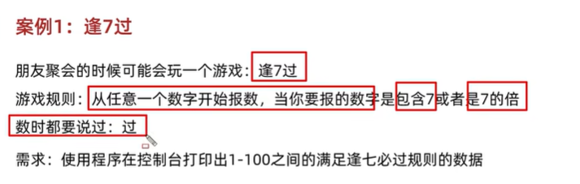
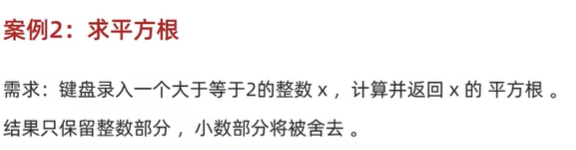

## 1、循环

1、循环高级综合练习-01-无限循环和跳转控制语句
* 无限循环
*
```java

for(;;) {
  System.out.println("1");
}
while (true) {
  System.out.println("1");
}
do {
  System.out.println("1");
} while(true)

```
```java
  package com.test7;

  import java.util.Scanner;

  public class Main {
    public static void main(String[] args) {
      //跳转控制
      for (int i = 1;i <= 5; i++) {
        if( i == 3) {
          //跳过本次循环，进入下一次，跳过 i=3的情况
          continue;
        }
        System.out.println("本次为第"+i+"次循环");
      }

      for (int i = 1;i <= 5;i++) {
        if ( i == 3) {
          break;
          //结束整个循环
        }
        System.out.println("1");
      }
    }
  }
```
2、循环高级综合练习-02-逢七过
* 
  
```java
  package com.test7;

  public class Main {
    public static void main(String[] args) {
      for (int i =1;i <= 100; i++) {
        if ( i % 7 != 0) {
          continue;
        }
        System.out.println("过");
      }
      
    }
  }
  //esay!
```
3、循环高级综合练习-03-平方根
* 
```java
  package com.test7;

  import java.util.Scanner;

  public class Main {
    public static void main(String[] args) {
      Scanner sc = new Scanner(System.in);
      System.out.println("请输入一个大于等于2的整数")
      int x = sc.nextInt();
      if (x >= 2) {
        int result = (int) Math.sqrt(x);
        // int result = (int) Math.sqrt(x);
        System.out.println("这个数字的平方根的整数部分为："+ result);
      } else {
        System.out.println("请重新输数字");
      }
      scanner.close();
      

    }
  }
```
4、循环高级综合练习-04-判断是否为质数
* 输入一个正整数x，判断该数是不是一个质数
```java
  package com.test7;

  import java.util.Scanner;

  public class Main {
    public static void main(String[] args) {
      Scanner sc = new Scanner(System.in);
      System.out.println("请输入一个正整数");
      int x = sc.nextInt();

      //质数可以用平方根 Math.sqrt(x)来匹配

      if (x < 2) {
        System.out.println(x + "不是质数，且质数为大于1的自然数")
      } else {
        for ( int i = 2; i <= Math.sqrt(x); i++) {
          if (x % i == 0) {
            System.out.println(x + "不是质数");
            return;
          }
        }
        System.out.println(x + "为质数");
        
      }

    }
  }
```
5、循环高级综合练习-05-猜数字小游戏
```java
  package com.test7;

  import java.util.Scanner;

  public class Main {
    public static void main(String[] args) {
      
    }
  }
```

## 2、数组

## 3、方法

## 4、综合练习

