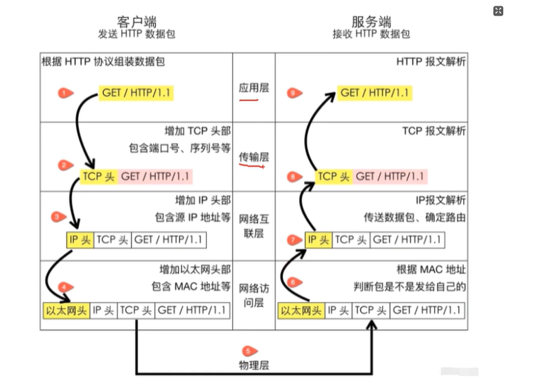

# TCP/IP 协议20问

## 1/什么是TCP网络分层

一共分为5层：应用层 》》 传输层 》》 网络互连层 》》 网络访问层 》》 物理层
比如说从客户端发送报文，那么必定会经过五层

* （0）由客户端Client发送HTTP请求
* （1）在应用层：从client发送请求，第一层根据HTTP协议组装数据包，以GET方式，携带了GET/HTTP/1.1头进行请求，
* 2）在传输层，增加TCP头部，包含端口号序列号等 TCP头/GET/HTTP/1.1
* 3）在网络互连层，增加IP头部，包含源IP地址等，IP头/TCP头/GET/HTTP/1.1
* 4）在网络访问层，增加以太网头部，包含MAC地址等，以太网头/IP头/TCP头/GET/HTTP/1.1
* 5）来到物理层，到服务端
* 6）继续走到网络访问层，以太网头/IP头/TCP头/GET/HTTP/1.1，根据MAC地址，判断包是不是发给此服务端的，继续走
* 7）来到网络互联层，由IP报文解析，传送数据包，确定路由，IP头/TCP头/GET/HTTP/1.1
* 8）走到下一层，传输层，根据TCP报文解析，/TCP头/GET/HTTP/1.1
* 9）走到应用层，进行HTTP报文解析，保留GET/HTTP/1.1
* 10）来到服务端，接受HTTP数据包
* 
**这种网络分层架构的好处：**

* 应用层：应用程序之间如何互相传递报文，比如HTTP协议
* 传输层：传输层的作用为两台主机之间的“应用进程”提供端到端的逻辑通信，比如TCP协议
* 网络互联层：网络互连层提供了主机到主机的通信，将传输层产生的数据包封装成分组数据包发送到目标主机，并提供路由选择的能力；IP协议是网络层的主要协议，TCP和UDP都是用IP协议作为网络层协议；这一层的主要作用是给包加上源地址和目标地址，将数据包传送到目标地址
* 网络访问层：网络访问层也可以叫做网络接口层，以太网、wifi、蓝牙工作在这一层，网络访问层提供了主机连接到物理网络需要的硬件和相关的协议
* 好处：
  * 各层独立：限制了依赖关系的范围，各层之间使用标准化的接口，各层不需要知道上下层是如何工作的，增加或修改一个应用层协议不会影响传输层的协议
  * 灵活性更好：比如路由器不需要应用层和传输层，分层以后路由器就可以只用加载更少的几个协议层，
  * 易于测试和维护：提高了可测试性，可以独立的测试特定层，某一层有了更好的实现可以整体替换掉
  * 能促进标准化：每一层职责清楚，方便进行标准化

---

## 2/TCP的三次握手中为什么是三次？为什么不是两次、四次？
1、三次握手讲解：
* 第一次：client向服务器发送一个SYN（同步）包，表面客户端需要与服务器建立连接，并在包中指定了自己的初始序列号Seq=x；此刻客户端进入SYN_SENT状态
* 第二次：服务端接收到客户端的SYN包后，会向客户端发送一个SYN+ACK包，其中ACK是对客户端SYN的确认，确定号为Ack=x+1；同时服务器也会指定自己的初始序列号为Seq=y；此刻服务器进入SYN_RCVD状态
* 第三次：客户端接收到服务端的SYN+ACK包后，会向服务器发送一个ACK包，确认包号为ACK=y+1；序列号为Seq=x+1；服务器收到这个ACK包后，连接建立成功，双方进入ESTABLISHED状态；
  
2、为什么不是两次
* 无法确认客户端接收能力：两次握手，服务器无法确认客户端是否接收到正确的SYN+ACK包；比如客户端的SYN包丢失，服务器发送的SYN+ACK包到了客户端，客户端会认为这是一个新的请求而发送RST包拒绝，而服务器认为连接已经建立，导致后续传输出现问题
* 无法可靠建立连接：两次握手不能确认双方都确认彼此的接收和发送能力，可能出现数据传输不稳定的情况，无法保证TCP连接的可靠性

3、为什么不是四次
* 三次已经完成确认：多此一举
* 效率问题：网络开销和时间延迟

**问法**
* 1、原理角度
  * 详细解释一下 TCP 三次握手的过程，以及每一次握手的作用是什么？
    * 第一次握手：client发送SYN包，告知server自己需要建立连接和初始序号，
    * 第二次握手：server发送SYN+ACK包，确认client请求和告知自己的序列号
    * 第三次握手：client发送ACK包，让server知道了client已经收到server的请求，双方确认可以正常收发数据
  * 在 TCP 三次握手过程中，各个阶段的数据包都包含哪些主要字段，这些字段是如何变化的？
    * SYN/ACK/Seq/Ack等字段
    * 第一次：SYN=1,Seq=x，
    * 第二次：SYN=1,ACK=1,Ack=x+1，Seq=y
    * 第三次：ACK=1,Ack=y+1，Seq=y+1
  * TCP 三次握手的过程中，如果第二次握手丢失了，会发生什么情况？
    * client会无法接收到服务器确认而重发SYN包，服务端未接收到client的SYN也会重发SYN+ACK，直到连接建立或超时放弃

* 2、与其它协议对比
  * TCP 三次握手和 UDP 的连接方式有什么本质区别？为什么 UDP 不需要类似的握手过程？
    * TCP是面向连接、可靠的传输协议，需要三次握手进行确认连接保证数据的可靠传输，UDP是无连接的，不保证数据可靠到达，无需握手，适用于对实时性要求高但不要求绝对可靠的场景，如视频直播
  * HTTP 基于 TCP 协议，它在建立连接时是如何利用 TCP 三次握手的
    * HTTP 请求前先通过 TCP 三次握手建立连接，握手成功后 HTTP 在连接上进行数据请求和传输。
* 3、实际应用和优化角度
  * 在高并发场景下，TCP 三次握手可能会带来哪些性能问题？如何优化？
    * 连接延迟、资源消耗；可采用：连接池、优化TCP参数增加缓存，调整超时时间
  * 请举例说明在实际的网络应用中，TCP 三次握手是如何保证数据传输的可靠性的？
    * 三次握手确认client和server准保好传输数据，后续传输、重传等机制保证数据准确到达
  * 在网络环境不稳定的情况下，TCP 三次握手可能会遇到哪些挑战？如何应对这些挑战？
    * 丢包、延迟、资源占用；超时重传、快速重传、拥塞机制

* 4、拓展角度
  * 除了三次握手，TCP 还有哪些重要的机制来保证网络通信的可靠性和效率？
    * 确认应答、超时重传、滑动窗口、拥塞机制
  * 如果让你设计一个类似 TCP 的传输协议，你会考虑保留三次握手这个机制吗？为什么
    * 会；简单高效确认双方确认连接状态和收发能力，为后续可靠连接传输奠定基础，保证连接准确性和高效性的经典设计

## 3/TCP的四次挥手为什么是四次？为什么不能是三次？
四次挥手是为了确保连接双方都可以完成数据传输并且可靠地关闭连接，不能用三次握手取代是以为：
 1、四次挥手的必要性：
  1）TCP连接的半关闭特性：TCP连接是全双工的，这意味着数据可以在两个方向上独立的流动；在关闭连接时候，需要分别处理每个方向上的数据传输和连接关闭，四次挥手就是为了实现这种半关闭的特性，允许乙方先停止发送数据，而另外一方任然继续接收和处理已经发送但未处理完的数据
  2）确保数据的完整性：在挥手过程中，主动关闭方发送FIN包表示它已经没有数据要发送了，但接收方可能还有些数据需要继续发送接收方在收到FIN包后，先回复ACK确认收到了FIN包，这是因为接收方还需要一定的时间来处理和发送剩余的数据，当接收方的数据发送完毕后，在发送FIN包给主动关闭方，主动关闭方收到后发送ACK，这样子确定了双方的数据都能完整的传输和处理

  2、不能用三次挥手的原因：
  1）无法保证数据传输完成：如果采用三次回收，假设主动关闭方发送FIN包后，被动关闭方直接发送FIN+ACK合并的包给主动发，然后主动发回复ACK完成握手；那么这样子可能出现问题，因为被动关闭方在发送ACK和FIN包后，可能还有数据没有传输完成，而主动关闭方收到FIN+ACK后就默认数据已经传输完成，会导致丢数据

  3、四次挥手的完整过程：
  1）第一次挥手：主动关闭方发送一个FIN包，用来关闭主动发收到被动关闭方的数据传送，而此时主动发进入了FIN_WAIT_1状态
  2）第二次挥手：被动关闭方收到FIN包后，发送个ACK给主动关闭方，确认序号为 +1；此时被动关闭方进入CLOSE_AWAIT 状态，而主动关闭方进入FIN_WAIT_2状态
  3）第三次挥手：被动关闭方发送一个FIN，用来关闭被动方到主动关闭方的数据传送，此时被动关闭方进入LAST_ACK状态
  4）第四次挥手：主动关闭方收到了FIN包后，发送一个ACK包给被动关闭方，确认序号为 +1；此时主动个比方进入TIME_WAIT状态，而被动关闭方直接关闭连接，进入CLOSED状态；主动关闭方等待2MSL(最长报文段寿命)后进入CLOSED状态
 
  
## 4/为什么 SYNFIN 不包含数据却要消耗一个序列号
在TCP协议中，SYN和FIN包不包含数据但仍要消耗一个序列号：
1、实现可靠的连接建立与关闭
1）连接建立SYN消耗序列号：SYN标志用于发起TCP连接请求；消耗一个序列号可以让通信双方在连接初始阶段就对序列号达成一致，为后续的数据传输建立一个可靠的起始点；接收方根据这个序列号，能够发送方知道它的连接请求已经被正确接收；双方可以基于这个序列号来对后续传输的数据包进行编号和确认，确保数据传输的有序性和准确性
2）连姐关闭时候FIN消耗序列号：FIN标志用于表达发送方已经完成书v就发送，希望连接光比；消耗一个序列号可以使关闭 连接的国产更加可靠；发送方发送待遇FIN的数据包并且使用一个序列号；接收方对该序列号进行确认；这样子可以保证双方都明确连接关闭的操作已经背对方知晓，避免出现连接关闭国产的数据丢失火状态不一致的问题

2、遵循TCP协议的状态机和滑动窗口机制
1）复合状态机逻辑：TCP协议有一套复杂的状态机来管理连接的各个阶段；SYN和FIN包的序列号消耗是状态机正常运转的一部分；例如，在连接建立时，发送SYN包后，发送方进入SYN_SENT状态，等待接收方的SYN+ACK；消耗序列号使得状态的转变和序列号的交互紧密相关，确保协议状态的准确切换和连接的正确管理
2）适配滑动窗口机制：滑动窗口用于控制数据流量和实现可靠传输；序列号是滑动窗口机制的关键元素。即使是SYN和FIN这样的康之宝。消耗序列号也有助于在连接建立和关闭阶段与滑动窗口机制进行协调；比如，在连接建立时，通过SYN包的序列号可以确定初始的窗口大小和数据传输的起始位置，为后续滑动窗口的数据传输做好准备

3、便于差错检测与恢复
1）检测数据丢失火重复：序列号在TCP的差错检测中骑着主要左右；SYN和FIN包消耗序列号可以让接收方更加容易检测到是否有数据包丢失或重复，例如，如果接收方没有收到某个SYN或者FIN包对应的确认ACK，发送方可以根据序列号出发该包，以确保连接建立或关闭国产的顺利进行
2）协助回复连接状态：在网络出现故障或异常。序列号有助于TCP进行连接状态的回复；如果在连接建立或关闭过程中出现问题，通过记录和检查序列号，双方可以确定当前的连接进度，进而采取相应的措施来回复连接，保证通信的可靠性


## 5/什么是半连接队列？什么是SYN Flood攻击？
1、半连接队列
1）定义：半连接队列也叫SYN队列，是TCP协议在处理连接过程中用于临时存储尚未完全建立连接的请求的一种数据结构；在TCP三次握手过程中，当服务器收到客户端发送的SYN包后，会讲该连接的请求放入半连接队列，并向客户端发送SYN+ACK包，此时连接处于半连接状态，即使客户端发起了连接请求，但是服务器还未收到客户端对SYN+ACK的确认包
2）作用：
* 缓冲连接请求：它起到了缓冲的作用，允许服务器在处理连接请求时，有一定的缓冲空间，避免因为同时处理过多的连接请求而导致系统崩溃或性能下降
* 维持连接状态：在半连接队列中的连接请求会保持相应的状态嘻嘻，知道收到客户端的ACK包或者连接请求超时

2、SYN Flood攻击
1）定义：SYN Flood攻击是一种常见的DDos（分布式拒绝攻击服务）攻击方式，它利用了TCP协议三次握手的特性来发起攻击，攻击者通过伪造大量源IP地址，向目标服务器发送海量的SYN包，请求建立TCP连接，但是不完成三次握手的后续步骤，既不回复服务器发送的SYN+ACK包

2）原理：
* 耗尽资源：由于服务器会为每个接收到的 SYN 包分配一定的资源，如在半连接队列中为其分配空间，并等待客户端的 ACK 包。当大量伪造的 SYN 包涌入时，半连接队列会被迅速填满，导致服务器无法处理正常的连接请求。
* 造成拒绝服务：随着半连接队列的满溢，服务器可能会开始丢弃新的连接请求，或者因为忙于处理这些虚假的连接请求而导致性能急剧下降，最终无法为合法用户提供正常的服务，从而达到拒绝服务的攻击目的。
3）危害：
* 业务中断：使目标服务器无法正常提供服务，导致网站无法访问、应用程序无法连接等问题，给企业和用户带来严重的损失。
* 数据丢失或损坏：在服务器资源耗尽的情况下，可能会导致正在处理的数据丢失或损坏，影响业务的正常运行和数据的完整性。
* 声誉受损：服务中断可能会影响企业的声誉，导致用户信任度下降，对企业的长期发展造成负面影响。

## 6/说说TCP快速打开(TFO)的原理
TCP快速打开(TFO)是一种旨在连接建立延迟的技术，其原理主要设计以下几个关键方面：
1、缓存cookie
* 客户端：在首次TCP连接时，客户端发送带有TCP Fast Opne选项的SYN包给服务器；服务器接收到后，若支持TFO，会生成一个加密的cookie，并且将放入SYN-ACK包中发送给客户端，客户端收到SYN-ACK包后，会缓存这个COOKIE
* 服务器：服务器端会维护一个COOKIE缓存，用于存储已经生成的Cookie以及相关的连接状态等，以便后续验证使用

2、携带数据
* 后续连接：当客户端再次与同意服务器建立连接时候，它可以在SYN包中携带之前缓存的cookie以及少量的应用数据，服务器收到带有cookie合数据的SYN包后，首先对cookie进行校验
* 提前处理：若干cookie校验成功，服务器就能够在完成第三次握手之前，提前处理服务端发送的由于数据，而无需像传统的TCP连接那样，必须等待三次握手完全后才开始处理数据

3、连接建立与确认
* 完成握手：在校验Cookie合处理数据的同时，扶我继续完成TCP三次握手的剩余步骤，向客户端发送SYN-ACK包，客服端发送ACK包，完成连接建立
* 数据传输：用于在握手过程中已经提前处理了部分数据，使得整体的数据传输时间提前，减少了连接建立的延迟，提高了数据传输的效率，尤其是对于小数据量的传输，效果更加明显

总结：从实现连接建立阶段就开始数据传输，从而减少了延迟，提高了网络性能合用户体验

## 7/TCP报文中的时间戳有什么作用？
TCP中的报文时间戳Timestamp是一个非常重要的字段，具有多种关键作用，主要包括实现精确的往返时间测量、进行有效的流量控制以及处理序列号回绕问题等。
1、精确测量往返时间RTT：
* 计算RTT:发送方在发送数据报文时，会在时间戳字段中记录当前的是兼职，接收方接收到报文，会在确认报文ACK中将接收到的时间戳鸳鸯返回给发送方；发送方收到ACK后，塘沽对比返回的时间戳合当前时间，就能计算出数据从发送到首收到确认的往返时间
* 性能优化：精确的RTT测量对于TCP协议跳转传输策略之光重要，例如，发送方可以根据RTT来动态跳转发哦是那个窗口大小合重传超时时间以适应网络状况的变化，提高数据传输效率，避免网络拥塞或数据重传过多

2、实现更加有效的流量控制
* 区分新旧数据：在高带宽，高延迟的网络环境中，可能会出现数据传输延迟较大，导致数据乱序到达的情况，时间戳可以帮助接收方区分新到达的书v就合鱿鱼网络延迟而玩到的旧数据，接收方根据时间戳判断数据的先后顺序，对于果实的数据可以进行想要处理，而不是错误德尔将其当作新数据进行接收合处理，从而保证了数据的正确性合有序性
* 准确反馈窗口大小：接收方可以根据时间戳合自身处理能力，更加准确的向发送方反馈可用的接收窗口大小，例如，如果接收方处理数据的速度较慢，它可以根据时间戳判断数据到达的速率，然后再ACK中通知发送方减小发送窗口，以避免接收方缓冲区溢出，实现更加精细的流量控制
3、解决序列号回绕问题
* 检测序列号重复：TCP的序列号是32位，再数据传输量巨大时候，序列号可能会回绕，即从最大值重新回到0开始技术，这可能导致接收方无法准确判断数据的顺序合完整性，时间戳位每个报文提供了一个额外的，单调递增的标志，即使序列号回绕，接收方也可以通过时间戳来判断报文的实际顺序，检测出是否有重复或丢失的报文，确保数据的准确接收合处理
* 确保数据完整性：再处理大规模数据车速，如文件传输或视频流传输时候，时间戳能有效防止序列号回绕而可能出现的数据混淆或错误，保证整个数据传输国产的完整性合准确性
4、支持TCP性能评估以及判断：
* 网络性能分析：通过TCP保卫呢汇总的时间戳信息，评估网络的性能状态，如网络延迟，都懂等指标，
* 故障排查：定位问题所在；某个时间段内大量报文的时间戳间隔异常增大，可能意味着网络再改时段出现 同色或其它故障，从而位故障排查合修复提供线索

## 8/TCP 的超时重传时间是如何计算的？
正经解释起来比较麻烦，设计公式计算
1、连接初期一般会有应该默认的初始RTO(TCP超时重传时间)，例如3s左右
2、随着数据传输，会根据RTT样本来计算平滑的RTT（SRTT）合RTT的偏差（RTTVAR）
3、一般RTO = SRTT+4 X RTTVAR
4、还有Karn算法，重传不更新RTT样本；快速重传机制下也会对RTO计算有影响，可能会适当跳转RTO

## 9/能不能说一说 TCP 的流量控制？
流量控制主要是靠滑动窗口机制来实现的，
1、基本原理：
* 接收方通过再TCP报文端的首部设置“窗口字段”，来告诉发送方自己的接收窗口大小，即自己还有多少缓存空间可以接收数据，发送方根据接收方的窗口大小来控制发哦是那个数据的速率，避免发送过快导致接收方缓存溢出

2、工作过程：
* 窗口大小协商：TCP连接建立时，双方会协商初始的窗口大小，之后再数据传输的过程中，接收方会根据自己的缓存使用情况合处理能力，动态的跳转窗口大小，并且通过ACK报文反馈给发送方
* 发送方控制：发送方有一个发送窗口，其大小不能超过接收方通告的窗口大小，发送方再发送数据时，会在发送窗口内发送数据，并根据接收方返回的ACK中携带的窗口消息，跳转自己的发哦是那个窗口大小
* 窗口滑动：当发送方首都奥接收方对已发送数据的ACK时候，表面这些数据已被接收方成功接收，发送窗口就会向前滑动，允许发送方发送更多的数据
3、特殊情况处理：
* 零窗口：当接收方的缓存已满时候，会向发送方发送窗口大小位-的报文，通知发送方暂停发送数据，发送方收到零窗口通知后，会启动一个持续定时器，当定时器超时，发送方会发送一个探测报文，询问接收方是否可以继续发送数据
* 窗口关闭：如果接收方的应用持续读取数据的速度非常慢，导致接收窗口一直位0，可能会使发哦是那个发长时间处于等待状态，为了避免，TCP规定当发送方收到连续三个相同的零窗口时候，就会关闭连接

## 10/如何理解 TCP 的keep-alive的原理？
Keep-Alive是一种用于检测连接是否有效的机制，其原理主要设计到定时发送探测包合根据响应判断连接状态：
1、机制开启与设置：
* TCP的Keep-Alive机制默认是关闭的，可以通过相应的系统参数或套接字选项来开启，开启后，还可以设置三个关键参数：Keep-Alive定时器市场、探测包发送间隔合探测次数，例如在一些系统中，默认的Keep-Alive定时器可能是2小时，探测包发送间隔位75秒，探测次数位9次，但这些值可以根据分局需求来进行调整
2、定时探测
* 当TCP连接在一段时间内（即：Keep-Alive定时器时长）没有数据交互时，开启了Keep-Alive机制的一段会像另外一段发送一个特殊的探测包，这个探测包一般只包含TCP首部，没有数据部分，其目的是为了检测对方是否在线，以及连接是否可以
3、响应处理
* 正常响应：若对方正常收到探测包并且处于正常运行状态，就会返回一个响应ACK包，发送探测包的一段收到ACK包后，就知道连接任然有效，会充值Keep-Alive定时器，等待下一个定时周期再次发送探测包，或者在有数据需要时候，正常发送数据
* 无响应或异常响应：如果发送方没有收到对方的响应，或者是收到的是异常的响应（如RST包，表示连接出现异常），则会根据设置的探测次数合探测包发送间隔，继续发送探测包，如果在规定的探测次数内任然没有收到正常响应，那么发送方就会认为连接以及失效，从而关闭连接或者采取其它响应的处理措施，比如重新建立连接等
4、应用场景
* 检测连接状态：对于长时间没有数据交互的TCP连接，如服务器与客户端之间的一些长连接，Keep-Alive可以即使检测到对方是否奔溃、网络是否终端等情况，以便释放资源或进行重连等操作
* 防止连接被中间设备关闭：在一些网络环境中，中间的路由器、防火墙等设备可能会因为没有长时间没有数据流量而关闭连接，Keep-Alive机制通过定时发送探测包，可以防止这种情况发生，保持连接的持续性

## 11/聊一聊TCP中的端口号
1、定义与作用
* 定义：端口号是一个16位的无符号整数，范围是0到65535，在TCP通信中扮演者类似“房间号”的角色，与IP地址共同构成了网络通信的端口标识
* 作用：在一台计算机上，可能同时运行着多个网络应用程序，例如浏览器、邮件客户端、文件传输工具等，当数据通过网络到达计算机时候，IP地址能确定是那台计算机收到数据，而端口号则能进一步确定该数据应该被发送到这台计算机上的哪个应用程序或进程，实现了不同应用程序之间数据的准确交付
2、端口号分类
* 知名端口号：范围是0到1023，通常被分配给一些常见的网络服务合应用程序，具有固定的用途；
  * HTTP协议默认使用80端口，
  * HTTPS使用443端口，
  * FTP协议使用20和21端口，
  * SMTP协议使用25端口等
* 注册端口号：范围是1024到49151，这些端口号通常由应用程序开发者在需要时向互联网号码分配机构（IANA）注册使用，用于一些特定的应用程序或服务，比如。MySQL数据库默认采用3306，Oracle数据库使用1521端口等
* 动态或私有端口号：范围是49152到65535，这些端口号主要用于客户端应用程序在运行时动态分配，客户端程序在发起网络连接时候，会从这个范围内随机选取一个未被使用的端口号作为自己的源端口，与服务器端的特点端口进行通信
3、分配与使用
* 服务器端：服务器上的应用程序通常会被绑定到一个特定的知名端口号或注册端口号上，以便能够接收到来自客户端的连接请求，当服务器启动时候，他会将自己的服务与指定的端口号进行绑定，然后开始监听改端口，等待客户端的连接
* 客户端：客户端在发起连接时候，会随机选择一个动态端口号作为源端口，然后指定要连接的服务器的IP地址和目标端口号（即服务器端应用程序所监听的端口），向服务器发送连接请求，在震哥哥通信国产中，客户端会使用这个动态端口号与服务器进行数据交互
4、安全性与管理
* 安全风险:开发可能带来风险，扫描入侵
* 管理策略：关闭不必要的端口，采用防火墙对进出端口进行过滤和监控，防止非法的网络访问

## 12/TCP场景问题1
两个主机之间建立了一个TCP连接，A主机给B主机发送了俩TCP报文，大小分别是500和300，第一个报文序列号是200，那么B主机收到俩报文后，返回的序列号是多少

1、序列号为标识发送的数据字节流中的位置，确认号则是期望收到的下一个字节的序列号
2、第一个报文的序列号是200，那么报文的最后一个字节的序列号是699,第二个报文的序列号应该是700,该报文最后一个字节的序列号为999
3、B主机收到这俩报文后，期望收到的下一个字节的序列号是1000，所以B主机返回的确认序列号是1000

## 13/TCP场景问题2
收到IP数据包解析以后，它是如何知道这个分组应该投递到上层的哪一个协议（UDP/TCP）
根据以下判断：
1、首部字段标识
* IP数据包的首部有一个“协议”字段，该字段占用**8位**，它的值明确指示了此IP数据包所承载的上层协议类型
  * 例如，当“协议”字段的值为6时，表示上层协议为TCP
  * 17时，UDP
* 网络设备或主机在接收到IP数据包并且解析其首部时，会查看这个字段的值
2、端口号关联
* TCP/UDP 协议中，都有端口号的概念；端口号用于标识不同的应用程序或服务，当IP数据包被递交给TCP/UDP后，其会根据数据包中的目的端口号，将数据进一步分发给相应的应用程序或服务；
  * 类似，WEB服务器通常采用80或443端口来接收客户端的请求
    * 当IP数据包中的目的端口号为80或443，且协议字段明确是TCP时，系统就知道该数据交给WEB服务器应用程序进行处理
    * 对于DNS服务通常采用UDP的53端口，当IP数据包的目的端口是53且协议字段为17（UDP），就会将数据交给DNS服务程序
3、其它因素辅助
* 上下文信息：网络设备或主机可能会维护一定的上下文信息，例如之前建立的连接状态，通过这些上下文信息，设备可以更加准确地判断IP数据包应该递交给哪个上层协议，如果设备已经知道某个特定的IP地址对之间正在进行TCP连接，那么后续来自这对IP地址的数据包可能也是属于该TCP凯娜姐，模糊判断也可
* 协议栈配置：操作系统或网络设备的协议栈配置也会影响IP数据包的分发，协议栈会根据预先设定的规则或配置，来确定如何处理不同协议和端口的数据包；
  * 类似，系统管理员可以配饰防火墙规则或网络策略，指定某些定源IP地址、目的IP地址、端口号范围的数据包应该优先递交给某个特定的上层协议处理，或者对某些协议进行特殊的过滤或处理

## 14/TCP场景问题3
TCP提供了一种字节流服务，而收发双方都不保持记录的边界，应用程序应该如何提供他们自己的记录标识呢

除了之前的消息长度字段、特殊分隔符、应用层规范以及自定义包头等方式外，还有如下方式：
1、定长记录
* 固定消息长度：应用程序规定所有发送的消息都有固定的长度，接收方按照固定长度来读取和解析数据，每读取固定长度的数据就认为是一条完整的记录，例如，在某些工业控制领域的通信协议中，规定每条控制指令消息的长度为32字节，那么接收方每收到32字节的数据就将其作为一条完整的控制指令进行处理
* 补齐与拆分：如果实际要发送的信息内容长度不足固定长度，可以采用补齐的方式，在消息末尾添加待定的填充字符或字节，使其达到固定长度，如果过长，则拆分

2、标记位与计数
* 设置记录 开始/结束 标记位：在消息中设置专门的标记位来表示记录的开始和结束，例如，使用应该特定的位组合，类似0xAA表示记录开始，0xBB表示记录结束；接收方在接收到数据后，通过查找这些标记位来确定记录的边界
* 记录计数：可以在消息中包含应该记录计数字段，拥堵表示当前发送的是第几条记录；接收方可以根据这个技术字段来记录进行排序和识别，同时也可以结合其它消息来判断记录的完整性和正确性，例如：在应该在一个数据库备份文件的传输中，每个记录可能都包含一个记录编号，接收方可以根据编号来确定是否由记录丢失或重复

3、加密与签名
* 加密与解密边界：在应用程序对数据进行加密处理时，可以将每条记录作为一个独立的加密单元进行加密，接收方在接收到加密数据后，通过解密来获取原始书v就，鱿鱼加密和解密是安吉路进行的，所以可以通过芥末的国产来确定记录的边界，即使在传输过程中数据的字节流没有明确的记录表示，通过加密和解密的逻辑也可以将不同的记录区分开
* 数字签名验证：位每条记录添加数字签名，接收方在接收到书v就后，通过验证数字签名来确定记录的完整性和真实性，在验证签名的过程中，实际上是对一条完整的记录进行操作，因此可以通过签名验证的范围来确定记录的边界

## 15/讲一讲telnet的用法
talnet是一种远程登录的网络协议
1、基本语法：
```
talnet [主机名或IP地址] [端口号]
```
如果不值得端口，则会默认23端口
2、连接远程主机
* 通过域名连接：类似example.com
```
talnet example.com
```
* 通过IP地址连接：
```
talnet 192.168.1.100
```
3、登录远程主机
连接到远程主机后，输入账号密码
4、执行命令
类似linux:ls,cd
windows:dir 查看目录内容
5、端口测试
```
talnet [IP] 80 //该命令未查看远程主机80端口/http是否占用/排查网络故障和配置服务器
```
6、退出talnet
```
exit
```
在使用 Telnet 时，需要确保你有远程主机的访问权限，并且目标主机开启了 Telnet 服务。由于 Telnet 以明文形式传输数据，存在安全风险，在实际应用中，更推荐使用更安全的 SSH 等协议进行远程连接。

## 16/讲一讲netstat的用法
netsetat是一个用于显示网络连接、路由表、接口统计等网络相关消息的命令行工具
1、查看所有连接和监听端口
* netstat -a //显示所有活动的网络连接以及计算机正在监听的端口
2、查看TCP连接
* netstat -t 可仅显示TCP连接的相关消息，能帮助了解当前系统中正在进行的TCP通信
3、查看UDP连接
* netstat -u 显示UDP连接和监听端口的信息，看哪些应用程序正在使用UDP进行数据传输
4、显示路由表
* netstat -r 查看路由表，了解数据在网路中的传输路径
5、显示网络接口统计信息
* netstat -i 显示网络接口的统计信息，如发送和接收的数据包数量和错误数量等

## 17/讲一讲tcpdump的用法
tcpdump未命令行网络数据包分析工具
1、捕获所有网络接口的数据包
tcpdump //捕获当前所有网络接口上的数据包
2、指定网络接口捕获
```
tcpdump -i eth0[网络接口]
```
3、根据协议过渡
```
tcpdump tcp //只捕获TCP协议的数据包；

```
```
tcpdump UDP //只捕获udp协议
```
4、根据主机IP过滤
* tcpdump host 192.168.1.100[IP地址] //捕获特定主机的相关数据包
* tcpdump src 192.168.1.100[IP地址] //根据src或dst 关键字分别指定源IP或目的IP
5、根据端口过滤
若只想捕获与特定端口（类似80）相关的数据包，可使用
* tcpdump port 80
* tcpdump tcp and port 80 //只捕获TCP协议且端口为80的数据包

## 18/讲一讲wireshark的用法
wireshark为图形化数据包分析工具（GUI）
1、启动
2、捕获
3、过滤：
* tcp.port == 80 //只显示TCP协议且端口号为80的数据包
* ip.addr == 192.168.1.100 //只显示与指定IP地址相关的数据包

## 19/TCP和UDP的区别
1、连接性
* TCP：面向连接的协议，数据传输前，需要在发送方和接收方之间建立连接（三次握手），书v就传输完还得关闭连接
* UDP：无连接的协议，发送数据时无需先建立连接
2、可靠性
* TCP：提供可靠的传输服务，通过序列号、确认应答、重传机制等保证数据能够准确无误地到达接收方，如果数据丢失或损坏，TCP会自动重传
* UDP：不保证数据的可靠性，数据发出后，不关心接收方是否成功接收，可能会出现数据丢、重复或损坏
3、传输效率
* TCP：由于需要建立连接、数据确认和重传等操作，传输效率较低，适用于对数据准确性要求高，但对实时性要求不特别严格的常见，类似文件传输、电子邮件等
* UDP：没有连接建立和复杂的确认机制，传输效率高，速度快，适用于对实时性要求高，但对数据准确性要求相对较低的场景，类似视频直播、实时游戏、语音通话等
4、数据传输单元
* TCP：TCP的传输是基于字节流的，数据被看成是连续的字节序列，无明确的边界
* UDP：数据传输是基于数据报的，每个书v就都是独立的，由明确的边界，类似一个个包裹，每个包裹抖音自己的源端口、目的端口、数据等信息

## 20/如果要你来设计一个QQ，在网络协议上你会考虑什么
1、登录采用TCP、HTTP，实时聊天UDP，内网P2P
2、登录过程，客户端client采用TCP协议向服务器server发送信息，HTTP协议下载信息，登录之后，会有一个TCP连接来保持在线状态
3、同好友进行信息传输，客户端client采用UDP将进行双向传输，但是还是得经过nginx服务器反向代理转发，为了确保传输消息的可靠，得采用上层协议保证可靠传输，如果消息发送失败，客户端会提示传输失败，进行重新传输
4、内网传输：P2P，无需服务器中转

